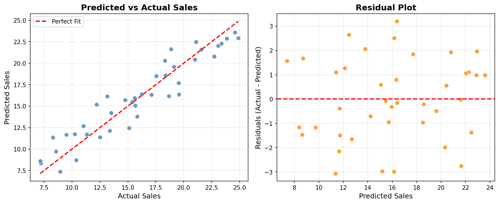

# 📈 Linear Regression Sales Prediction

A machine learning project that uses **Multiple Linear Regression** to predict product sales based on advertising spend across **TV**, **Radio**, and **Newspaper** channels — built with Python and scikit-learn.

---

## 📌 Overview

This project demonstrates the complete machine learning pipeline — from loading advertising data to training a regression model, evaluating performance, and visualizing predictions.

**Business Question:** *How much does advertising spend on TV, Radio, and Newspaper influence sales?*

> The model learns the relationship between advertising budgets and sales figures, enabling future sales predictions based on planned ad spend.

---

## 📊 Dataset — `advertising.csv`

| Column | Type | Description |
|---|---|---|
| `TV` | float | Advertising spend on TV (in thousands) |
| `Radio` | float | Advertising spend on Radio (in thousands) |
| `Newspaper` | float | Advertising spend on Newspaper (in thousands) |
| `Sales` | float | **Target** — Units sold (in thousands) |

- **Total Samples:** 200 rows × 4 columns
- **Train / Test Split:** 160 training / 40 testing (80/20)

---

## 📁 Project Structure

```
Linear_Regression_sales_Prediction/
│
├── advertising.csv                     # Input dataset (200 rows)
├── regression_prediction.csv           # Output: Actual vs Predicted sales
├── Linear_Regression__prediction.ipynb # Main Jupyter Notebook
├── images/
│   ├── model_plots.png                 # Predicted vs Actual + Residual plots
│   └── feature_coefficients.png        # Feature coefficient bar chart
└── README.md
```

---

## ⚙️ Installation

### 1. Clone the repository

```bash
git clone https://github.com/SumiyaMS/Linear_Regression_sales_Prediction.git
cd Linear_Regression_sales_Prediction
```

### 2. Install dependencies

```bash
pip install pandas scikit-learn matplotlib jupyter
```

---

## 🚀 Usage

```bash
jupyter notebook Linear_Regression__prediction.ipynb
```

Run all cells in order to reproduce the full analysis and results.

---

## 🔄 Model Workflow

```
1. Load Data          →  Read advertising.csv into Pandas DataFrame
2. Feature Selection  →  X = [TV, Radio, Newspaper]  |  y = Sales
3. Train/Test Split   →  80% Train (160) / 20% Test (40), random_state=42
4. Train Model        →  LinearRegression().fit(X_train, y_train)
5. Predict            →  Predict on both train and test sets
6. Evaluate           →  R², MAE, MSE, RMSE
7. Visualize          →  Scatter plot + Residual plot
8. Export             →  Save predictions to regression_prediction.csv
```

---

## 📉 Model Results

### Performance Metrics

| Metric | Train Set | Test Set |
|---|---|---|
| **R² Score** | 0.8252 | **0.8933** |
| **MAE** | — | 1.4092 |
| **MSE** | — | 2.7607 |
| **RMSE** | — | 1.6615 |

> The model explains **89.3%** of the variance in sales on unseen test data.

### Model Equation

```
Sales = 4.8246
      + 0.0490 × TV
      + 0.1121 × Radio
      + 0.0163 × Newspaper
```

> **Radio** has the strongest influence on sales per unit of spend, followed by TV and then Newspaper.

---

## 📊 Visualizations

### Predicted vs Actual Sales & Residual Plot



### Feature Coefficients


---

## 📤 Output — `regression_prediction.csv`

The notebook exports a CSV of test-set predictions:

| Actual_Sales | Predicted_Sales |
|---|---|
| 14.76 | 15.71 |
| 8.56 | 9.73 |
| 17.54 | 18.50 |
| ... | ... |

---

## 🛠️ Technologies Used

| Tool | Purpose |
|---|---|
| **Python 3.x** | Core language |
| **Pandas** | Data loading & manipulation |
| **scikit-learn** | Linear Regression, train/test split, metrics |
| **Matplotlib** | Scatter and residual plots |
| **Jupyter Notebook** | Interactive development |

---

## 🤝 Contributing

1. Fork the repository
2. Create your branch: `git checkout -b feature/your-feature`
3. Commit: `git commit -m "Add your feature"`
4. Push: `git push origin feature/your-feature`
5. Open a Pull Request

---

## 👩‍💻 Author

**SumiyaMS** — [@SumiyaMS](https://github.com/SumiyaMS)

---

> ⭐ Star this repo if you found it helpful
> 
